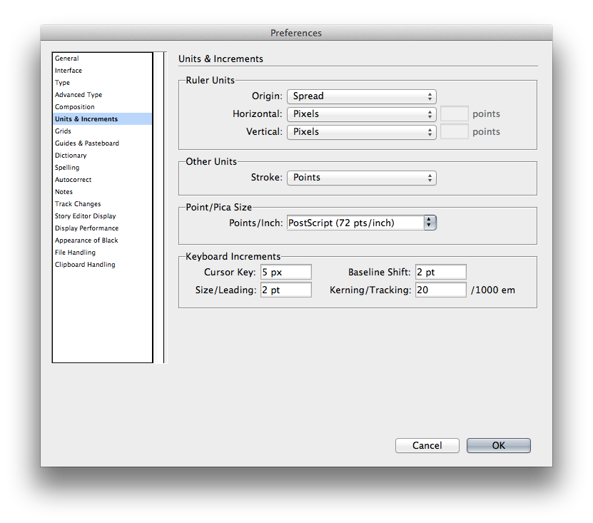
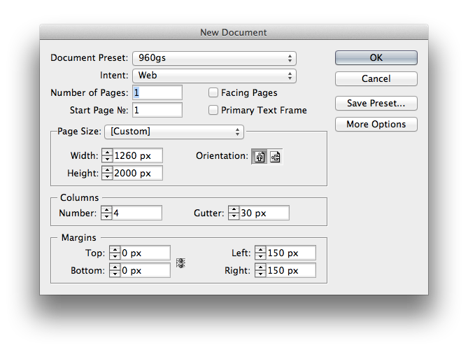
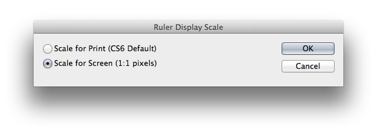
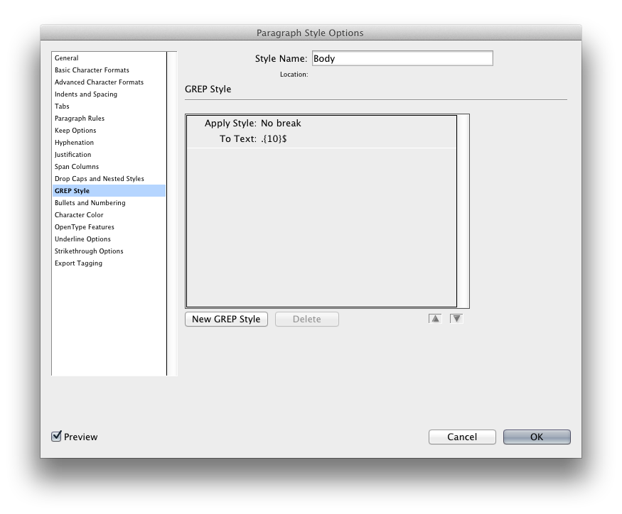

# Getting started with InDesign for web

InDesign is pretty great for web work, although it doesn't seem that way out of the box.

Here's my preferred setup.

Open `Preferences > Units and Increments…` and set it up like this.

When you create a new document, set it up like this. You can save these settings as a preset for later.

## Installing the scripts

The scripts DisplayScale.scpt and HexSwatch.jsx are pretty much mandatory for web work.

Open `Window > Utilities > Scripts`. Right-click on the `User` folder and choose `Reveal in Finder`.

Install the scripts DisplayScale.scpt and HexSwatch in this folder.

Run the script DisplayScale and select `Scale for screen`. Then press `cmd + 0` to view your document at 100% – this is how it'll appear in browser.

<!--  -->
